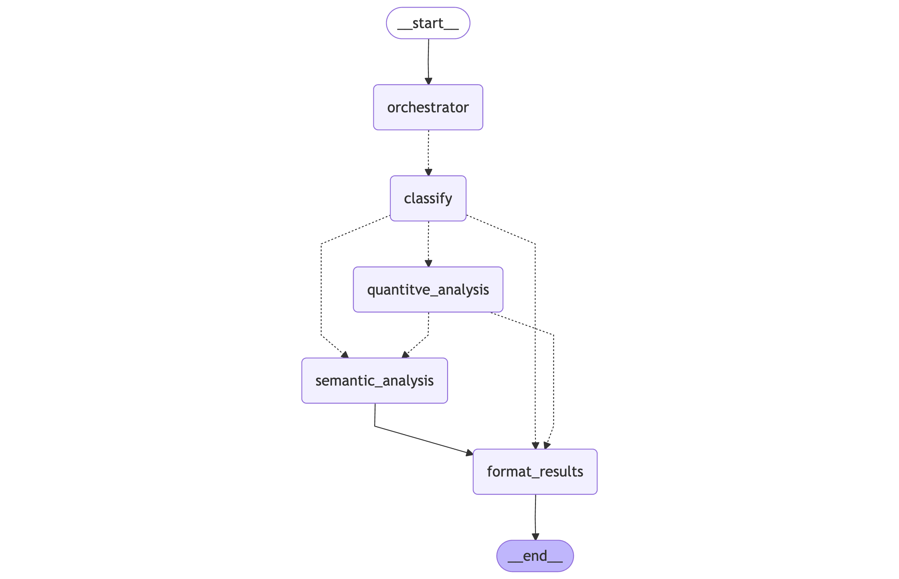

# 📊 Feedback Analysis Agent

An AI-powered application that analyzes user feedback using natural language queries. Built with Streamlit, LangChain, and OpenAI.

## 📖 Overview

This application intelligently processes and analyzes customer feedback data through a sophisticated multi-agent architecture. The system automatically classifies incoming queries and routes them through specialized analysis pipelines:

- **Query Classification**: Uses GPT-4 to categorize user questions into quantitative (filtering, counting, statistics) and semantic (topics, themes, sentiment) analysis types
- **Quantitative Analysis**: Employs LangChain's Pandas DataFrame Agent for data manipulation, filtering, and statistical computations
- **Semantic Analysis**: Leverages GPT-4 to identify themes, topics, and patterns in feedback text (uses first 300 rows for efficiency)
- **Orchestrated Workflow**: Built on LangGraph's StateGraph to manage multi-step analysis chains and conversation flow

The architecture enables complex queries like "What are the main complaints in feedback with ratings below 3?" by automatically splitting them into filtering operations followed by semantic analysis.

## 🏛️ Architecture



The system is built using LangGraph's StateGraph with the following nodes:

1. **Orchestrator Node**: Routes queries to either direct response or analysis pipeline
2. **Classify Node**: Splits user queries into quantitative and semantic components using structured LLM output
3. **Quantitative Analysis Node**: Executes pandas operations for data filtering and statistics
4. **Semantic Analysis Node**: Analyzes text content to extract themes and topics
5. **Format Results Node**: Combines and prioritizes results for user presentation

The state management tracks messages, classifications, dataframes, and analysis results throughout the execution flow.

## 🌟 Features

- **Natural Language Interface**: Ask questions about your feedback data in plain English
- **Intelligent Analysis**: Powered by OpenAI's GPT-4 and LangChain
- **Pandas Integration**: Automatically translates questions to pandas operations
- **Interactive UI**: Clean, user-friendly Streamlit interface
- **Data Visualization**: View dataset overview and statistics

## 📋 Prerequisites

Before you begin, ensure you have:

- **Python 3.8 or higher** installed on your system
- **OpenAI API Key**: Sign up at [OpenAI Platform](https://platform.openai.com/) and create an API key
- **Your feedback data**: A CSV file named `feedback.csv` in the project root directory

## 🚀 Installation

Follow these steps to set up the application locally:

### 1. Clone or Download the Project

```bash
cd feedback-anlaysis-agent
```

### 2. Create a Virtual Environment

**On macOS/Linux:**
```bash
python3 -m venv venv
source venv/bin/activate
```

**On Windows:**
```bash
python -m venv venv
venv\Scripts\activate
```

### 3. Install Dependencies

```bash
pip install -r requirements.txt
```

### 4. Configure Environment Variables

1. Copy the example environment file:
   ```bash
   cp .env.example .env
   ```

2. Open `.env` in a text editor and add your OpenAI API key:
   ```
   OPENAI_API_KEY=your_actual_api_key_here
   ```

## ▶️ Running the Application

1. Make sure your virtual environment is activated
2. Run the Streamlit app:

```bash
streamlit run app.py
```

3. The application will open in your default web browser at `http://localhost:8501`

## 🔍 Example Queries & Execution Logs

Below are real execution traces from the LangSmith platform showing how the agent processes complex queries:

### Query 1: Multi-step Analysis
**Query**: "What are the 5 main topics of feedbacks with level < 3?"

This query demonstrates the agent's ability to:
1. Classify the query into quantitative (filtering Level < 3) and semantic (finding main topics) components
2. Execute pandas filtering to isolate low-rating feedback
3. Perform semantic analysis on the filtered subset

**View full execution trace**: [LangSmith Run #1](https://smith.langchain.com/public/13216407-472f-4a02-a4f9-3a140c584f37/r)

### Query 2: Quantitative Analysis
**Query**: "How many feedbacks per ServiceName?"

This query shows pure quantitative analysis:
1. Classification identifies only quantitative analysis needed
2. Pandas agent performs groupby and count operations
3. Results are formatted and returned

**View full execution trace**: [LangSmith Run #2](https://smith.langchain.com/public/10cef314-703e-4048-9245-0e509938bf93/r)

## 🏗️ Project Structure

```
feedback-anlaysis-agent/
├── app.py                 # Main application file
├── feedback.csv           # Your feedback data (you provide this)
├── requirements.txt       # Python dependencies
├── .env                   # Environment variables (create from .env.example)
├── .env.example          # Environment variables template
├── .gitignore            # Git ignore rules
└── README.md             # This file
```

## 🗺️ Roadmap (Further Development & Optimizations)

### Performance Optimizations
- **SQL Database Integration**: Consider migrating from in-memory pandas DataFrames to SQL database (PostgreSQL/SQLite) for better memory performance and scalability with larger datasets
- **Incremental Loading**: Implement lazy loading and pagination for large datasets

### Cost & Efficiency Improvements
- **LLM Model Routing**: Implement intelligent model routing to use simpler and cheaper models (e.g., GPT-3.5-turbo) for primitive decisions and classifications, reserving GPT-4 only for complex semantic analysis
- **Caching Layer**: Add caching for repeated queries and classification results

### Feature Enhancements
- **RAG Integration**: Extend the application with Retrieval-Augmented Generation (RAG) tools to support queries like:
  - "Give me query examples of reviews containing technical issues"
  - "Show me similar feedback to: [example text]"
  - Enable semantic search across historical feedback
- **Advanced Analytics**: Add trend analysis, sentiment scoring, and automated insight generation
- **Multi-language Support**: Extend query classification and analysis to support multiple languages

---

**Built with** 🦜 LangChain | 🤖 OpenAI | 📊 Streamlit | 🐼 Pandas
